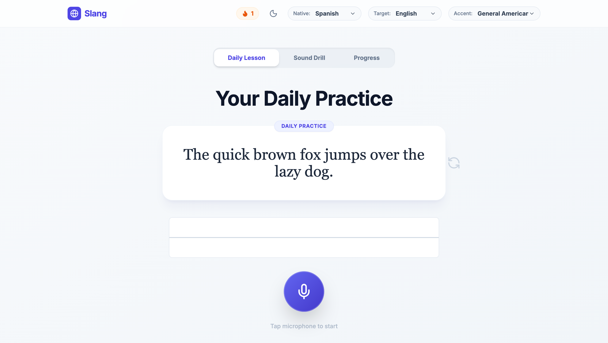

# Slang — AI Pronunciation & Fluency Coach

> Real-time phonetic analysis with corrective feedback — see your pronunciation against a native reference, phoneme by phoneme.

`TypeScript` · `React` · `Vite` · `Gemini` · `Web Audio`



---

## The idea

Most language apps grade you on *vocabulary* because it's easy to score. Pronunciation is where adult learners actually stall, and it's the thing an app can measure objectively. Slang scores the audio.

## What it does

- **Phonetic analysis** of recorded speech with per-phoneme scoring
- **Articulation visualiser** — where the sound should be formed
- **Comparison player** — your recording against a reference, aligned
- **Waveform view** for timing and stress
- **IPA chart** and phoneme selector for targeted drilling
- **Generated lesson plans** adapted to your weak phonemes

## Architecture

Gemini is called **server-side only** (`server.ts`). The browser talks to `/api/analyze-audio`, `/api/generate-tts`, and `/api/generate-lesson-plan` — the API key never reaches the client.

## Run locally

**Prerequisites:** Node.js 18+

```bash
npm install
cp .env.local.example .env.local    # add your GEMINI_API_KEY
npm run dev
```

## Deploying

```bash
vercel                                    # link the project
vercel env add GEMINI_API_KEY production  # server-side only, never exposed
vercel --prod
```

The same Express app serves local development and runs as the Vercel function
(`api/index.ts`), so the API surface, rate limiting, and input sanitisation
cannot drift between environments.

> **Note on rate limiting:** the limiter holds state in memory. That is correct
> for a single instance but only partially effective across serverless
> instances — move it to a shared store (Vercel KV or Redis) before real
> traffic.

## Status

Working prototype — ~3,800 lines.

## License

MIT
